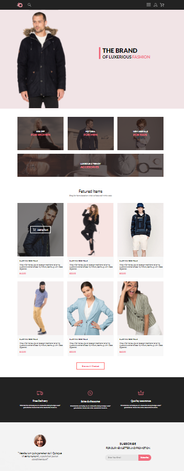
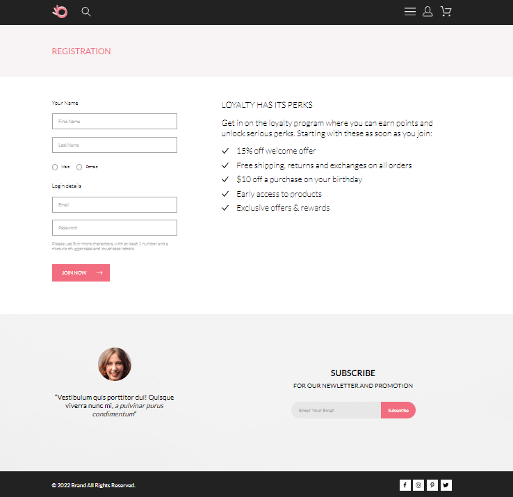
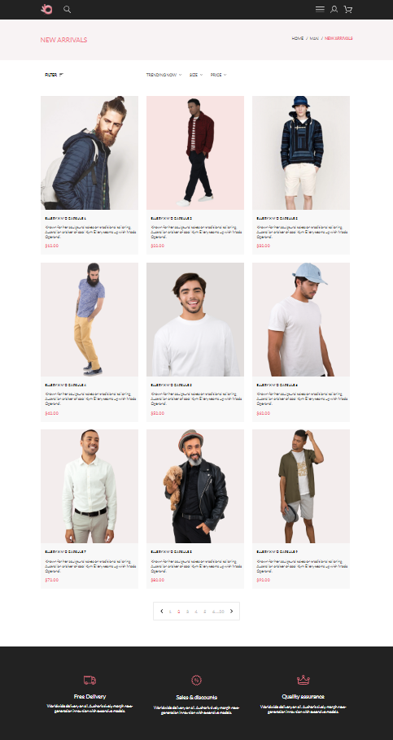
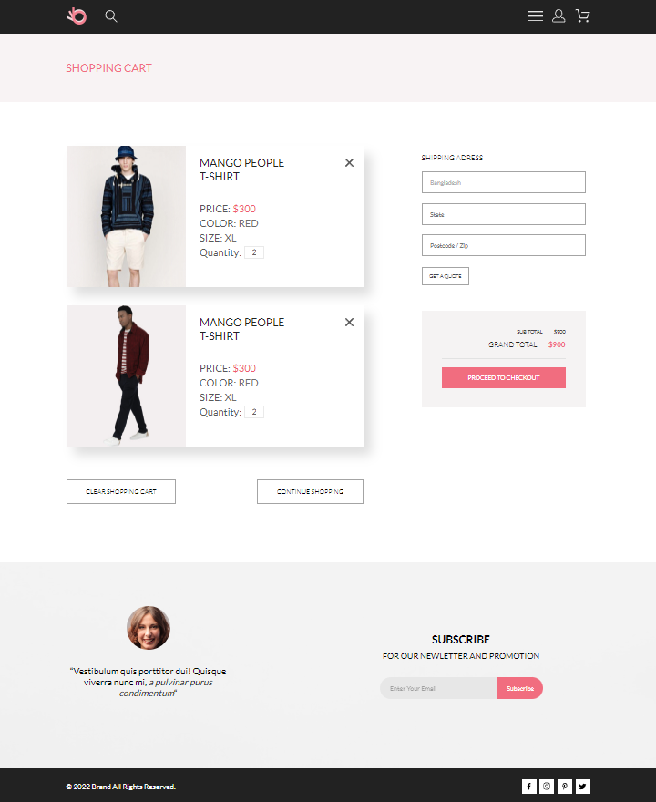
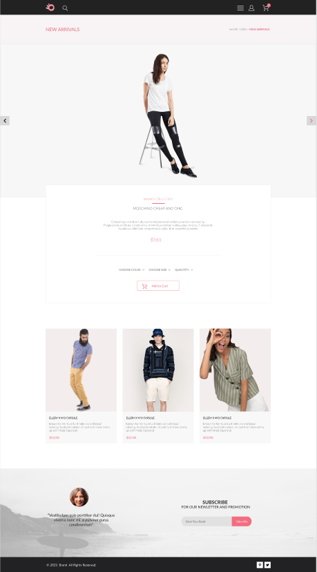

# Clothes store website
## Description(RU)
Данный веб-сайт собран исключительно на SCSS и HTML с минимальным добавлением JS. На JS написан функционал, имитирующий работу корзины. С демонстрацией работоспособности данного функционала можно ознакомиться на главной странице сайта и на странице каталога. На остальных страницах при нажатии на иконку корзины выполнится переход на страницу корзины. 

Целью разработки данного сайта была отработка навыков продвинутой верстки. Данный сайт имеет три брейк-пойнта для десктопной, планшетной и мобильной версии.  
## Description(EN)
This website is built exclusively on SCSS and HTML with minimal addition of JS. A functionality was written in JS that simulates the operation of the shopping cart. A demonstration of the functionality of this functionality can be found on the main page of the site and on the catalog page. On other pages, clicking on the cart icon will take you to the cart page.

The purpose of developing this site was to develop advanced layout skills. This site has three break points for desktop, tablet and mobile versions.

## Technologies used
* HTML
* SCSS
* JavaScript

## Visual display of the application's operation

  

  Picture 1. Index page.

  

  Picture 2. Burger menu.

  

  Picture 3. Registration page.

  

  Picture 4. Catalog page.

  

  Picture 5. Cart page.

  

  Picture 6. Product page.

